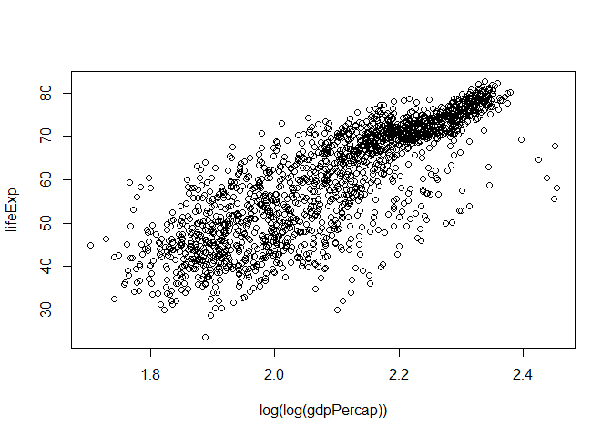

\#\#Loading Data Frame into R markdown In order to work with Data
Frames, we load the gapminder using the command library()

    library(gapminder)

\#\#Overview of the Data set The command summary() gives a statistical
overview of what the data frame looks like

    summary(gapminder)

    ##         country        continent        year         lifeExp     
    ##  Afghanistan:  12   Africa  :624   Min.   :1952   Min.   :23.60  
    ##  Albania    :  12   Americas:300   1st Qu.:1966   1st Qu.:48.20  
    ##  Algeria    :  12   Asia    :396   Median :1980   Median :60.71  
    ##  Angola     :  12   Europe  :360   Mean   :1980   Mean   :59.47  
    ##  Argentina  :  12   Oceania : 24   3rd Qu.:1993   3rd Qu.:70.85  
    ##  Australia  :  12                  Max.   :2007   Max.   :82.60  
    ##  (Other)    :1632                                                
    ##       pop              gdpPercap       
    ##  Min.   :6.001e+04   Min.   :   241.2  
    ##  1st Qu.:2.794e+06   1st Qu.:  1202.1  
    ##  Median :7.024e+06   Median :  3531.8  
    ##  Mean   :2.960e+07   Mean   :  7215.3  
    ##  3rd Qu.:1.959e+07   3rd Qu.:  9325.5  
    ##  Max.   :1.319e+09   Max.   :113523.1  
    ## 

\#\#Data exploration The following set of commands gives a brief
information about the data set

    str(gapminder)

    ## Classes 'tbl_df', 'tbl' and 'data.frame':    1704 obs. of  6 variables:
    ##  $ country  : Factor w/ 142 levels "Afghanistan",..: 1 1 1 1 1 1 1 1 1 1 ...
    ##  $ continent: Factor w/ 5 levels "Africa","Americas",..: 3 3 3 3 3 3 3 3 3 3 ...
    ##  $ year     : int  1952 1957 1962 1967 1972 1977 1982 1987 1992 1997 ...
    ##  $ lifeExp  : num  28.8 30.3 32 34 36.1 ...
    ##  $ pop      : int  8425333 9240934 10267083 11537966 13079460 14880372 12881816 13867957 16317921 22227415 ...
    ##  $ gdpPercap: num  779 821 853 836 740 ...

    head(gapminder)

    ## # A tibble: 6 x 6
    ##   country     continent  year lifeExp      pop gdpPercap
    ##   <fct>       <fct>     <int>   <dbl>    <int>     <dbl>
    ## 1 Afghanistan Asia       1952    28.8  8425333      779.
    ## 2 Afghanistan Asia       1957    30.3  9240934      821.
    ## 3 Afghanistan Asia       1962    32.0 10267083      853.
    ## 4 Afghanistan Asia       1967    34.0 11537966      836.
    ## 5 Afghanistan Asia       1972    36.1 13079460      740.
    ## 6 Afghanistan Asia       1977    38.4 14880372      786.

    tail(gapminder)

    ## # A tibble: 6 x 6
    ##   country  continent  year lifeExp      pop gdpPercap
    ##   <fct>    <fct>     <int>   <dbl>    <int>     <dbl>
    ## 1 Zimbabwe Africa     1982    60.4  7636524      789.
    ## 2 Zimbabwe Africa     1987    62.4  9216418      706.
    ## 3 Zimbabwe Africa     1992    60.4 10704340      693.
    ## 4 Zimbabwe Africa     1997    46.8 11404948      792.
    ## 5 Zimbabwe Africa     2002    40.0 11926563      672.
    ## 6 Zimbabwe Africa     2007    43.5 12311143      470.

    class(gapminder)

    ## [1] "tbl_df"     "tbl"        "data.frame"

    names(gapminder)

    ## [1] "country"   "continent" "year"      "lifeExp"   "pop"       "gdpPercap"

    ncol(gapminder)

    ## [1] 6

    nrow(gapminder)

    ## [1] 1704

    length(gapminder)

    ## [1] 6

\#\#Plotting and Data Visualisation Plots are used to properly visualise
the data set and R code chunks could be used for plotting

    plot(lifeExp~log(pop), gapminder)

    plot(lifeExp~log(log(gdpPercap)), gapminder)

\#\#Working with a single variable of the data set $ sign is used to
specify a single variable in the data set. the following set of commands
explores each set of the gapminder data frame

    class(gapminder$country)

    ## [1] "factor"

    levels(gapminder$country)

    ##   [1] "Afghanistan"              "Albania"                 
    ##   [3] "Algeria"                  "Angola"                  
    ##   [5] "Argentina"                "Australia"               
    ##   [7] "Austria"                  "Bahrain"                 
    ##   [9] "Bangladesh"               "Belgium"                 
    ##  [11] "Benin"                    "Bolivia"                 
    ##  [13] "Bosnia and Herzegovina"   "Botswana"                
    ##  [15] "Brazil"                   "Bulgaria"                
    ##  [17] "Burkina Faso"             "Burundi"                 
    ##  [19] "Cambodia"                 "Cameroon"                
    ##  [21] "Canada"                   "Central African Republic"
    ##  [23] "Chad"                     "Chile"                   
    ##  [25] "China"                    "Colombia"                
    ##  [27] "Comoros"                  "Congo, Dem. Rep."        
    ##  [29] "Congo, Rep."              "Costa Rica"              
    ##  [31] "Cote d'Ivoire"            "Croatia"                 
    ##  [33] "Cuba"                     "Czech Republic"          
    ##  [35] "Denmark"                  "Djibouti"                
    ##  [37] "Dominican Republic"       "Ecuador"                 
    ##  [39] "Egypt"                    "El Salvador"             
    ##  [41] "Equatorial Guinea"        "Eritrea"                 
    ##  [43] "Ethiopia"                 "Finland"                 
    ##  [45] "France"                   "Gabon"                   
    ##  [47] "Gambia"                   "Germany"                 
    ##  [49] "Ghana"                    "Greece"                  
    ##  [51] "Guatemala"                "Guinea"                  
    ##  [53] "Guinea-Bissau"            "Haiti"                   
    ##  [55] "Honduras"                 "Hong Kong, China"        
    ##  [57] "Hungary"                  "Iceland"                 
    ##  [59] "India"                    "Indonesia"               
    ##  [61] "Iran"                     "Iraq"                    
    ##  [63] "Ireland"                  "Israel"                  
    ##  [65] "Italy"                    "Jamaica"                 
    ##  [67] "Japan"                    "Jordan"                  
    ##  [69] "Kenya"                    "Korea, Dem. Rep."        
    ##  [71] "Korea, Rep."              "Kuwait"                  
    ##  [73] "Lebanon"                  "Lesotho"                 
    ##  [75] "Liberia"                  "Libya"                   
    ##  [77] "Madagascar"               "Malawi"                  
    ##  [79] "Malaysia"                 "Mali"                    
    ##  [81] "Mauritania"               "Mauritius"               
    ##  [83] "Mexico"                   "Mongolia"                
    ##  [85] "Montenegro"               "Morocco"                 
    ##  [87] "Mozambique"               "Myanmar"                 
    ##  [89] "Namibia"                  "Nepal"                   
    ##  [91] "Netherlands"              "New Zealand"             
    ##  [93] "Nicaragua"                "Niger"                   
    ##  [95] "Nigeria"                  "Norway"                  
    ##  [97] "Oman"                     "Pakistan"                
    ##  [99] "Panama"                   "Paraguay"                
    ## [101] "Peru"                     "Philippines"             
    ## [103] "Poland"                   "Portugal"                
    ## [105] "Puerto Rico"              "Reunion"                 
    ## [107] "Romania"                  "Rwanda"                  
    ## [109] "Sao Tome and Principe"    "Saudi Arabia"            
    ## [111] "Senegal"                  "Serbia"                  
    ## [113] "Sierra Leone"             "Singapore"               
    ## [115] "Slovak Republic"          "Slovenia"                
    ## [117] "Somalia"                  "South Africa"            
    ## [119] "Spain"                    "Sri Lanka"               
    ## [121] "Sudan"                    "Swaziland"               
    ## [123] "Sweden"                   "Switzerland"             
    ## [125] "Syria"                    "Taiwan"                  
    ## [127] "Tanzania"                 "Thailand"                
    ## [129] "Togo"                     "Trinidad and Tobago"     
    ## [131] "Tunisia"                  "Turkey"                  
    ## [133] "Uganda"                   "United Kingdom"          
    ## [135] "United States"            "Uruguay"                 
    ## [137] "Venezuela"                "Vietnam"                 
    ## [139] "West Bank and Gaza"       "Yemen, Rep."             
    ## [141] "Zambia"                   "Zimbabwe"

    summary(gapminder$continent)

    ##   Africa Americas     Asia   Europe  Oceania 
    ##      624      300      396      360       24

    nlevels(gapminder$continent)

    ## [1] 5

    table(gapminder$continent)

    ## 
    ##   Africa Americas     Asia   Europe  Oceania 
    ##      624      300      396      360       24

    summary(gapminder$lifeExp)

    ##    Min. 1st Qu.  Median    Mean 3rd Qu.    Max. 
    ##   23.60   48.20   60.71   59.47   70.85   82.60

    hist(gapminder$lifeExp)

    barplot(table(gapminder$continent))

